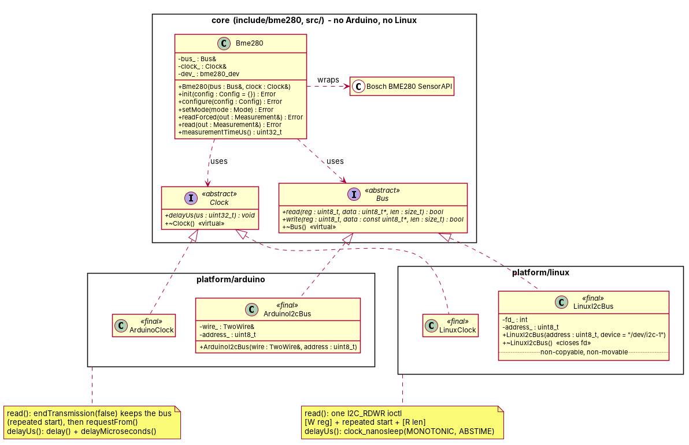

# Ander_PROG5 - BME280 sensor library (Prog 5)

C++ library for the Bosch BME280 (temperature, pressure, humidity). The Bosch BME280 SensorAPI
is wrapped in a class that talks to two abstractions, `Bus` and `Clock`, so the sensor code does
not depend on any particular board. This is the **Week 4** state: the same, unchanged core runs
on Arduino (Week 3) and on a Raspberry Pi through Linux `i2c-dev`.

The Week 3 state is preserved in the tag `v0.3-arduino`.

## Structure

```
include/bme280/     Bus.hpp, Clock.hpp (interfaces), Types.hpp, Bme280.hpp   <- core
src/                Bme280.cpp (wraps the Bosch C driver)                    <- core
                    Bme280Lib.h, arduino_glue_*.{c,cpp}   <- Arduino IDE build glue (see below)
third_party/bme280/ Bosch BME280 SensorAPI v3.5.1, vendored unmodified (BSD-3-Clause)
platform/arduino/   ArduinoI2cBus (Wire), ArduinoClock (delay/delayMicroseconds)
platform/linux/     LinuxI2cBus (/dev/i2c-N, ioctl), LinuxClock (clock_nanosleep)
examples/arduino/   ReadEverySecond, CustomConfig            (Arduino sketches)
examples/rpi/       smoke_test.cpp -> bme280_rpi_smoke       (Raspberry Pi)
tests/              host tests: core with mocks, Arduino bus with a fake Wire, Linux bus with a
                    fake ioctl, Linux platform
cmake/              cross-compile toolchains for Raspberry Pi OS (aarch64, armhf)
docs/               week4_class_diagram.{puml,svg,png}
CMakeLists.txt      core + Linux platform + examples + tests
library.properties  Arduino library metadata
```

The core (`include/bme280/*`, `src/Bme280.cpp`, `third_party/`) includes no Arduino, Wire or
Linux header, uses no `#ifdef` to tell platforms apart, and builds with any C++17 compiler.

## Week 4: Bus/Clock split



([PlantUML source](docs/week4_class_diagram.puml), [SVG](docs/week4_class_diagram.svg))

```
Bme280 --> Bus                 ArduinoI2cBus --|> Bus      LinuxI2cBus --|> Bus
Bme280 --> Clock               ArduinoClock  --|> Clock    LinuxClock  --|> Clock
```

All arrows point *into* the core: the platform classes depend on the abstractions, the core
never depends on a platform (Dependency Inversion). Nothing in `include/` or `src/Bme280.cpp`
names Arduino or Linux.

In Week 3, `Bus` had three methods: `read()`, `write()` and `delayUs()`. Week 4 moves the delay
into its own interface:

```cpp
class Bus {                                    class Clock {
public:                                        public:
    virtual ~Bus() = default;                      virtual ~Clock() = default;
    virtual bool read(uint8_t reg, uint8_t* data,  virtual void delayUs(uint32_t us) = 0;
                      size_t len) = 0;         };
    virtual bool write(uint8_t reg, const uint8_t* data, size_t len) = 0;
};

Bme280(Bus& bus, Clock& clock);
```

The `read()`/`write()` signatures are unchanged from Week 3. `Bme280` stores both references.
The Bosch driver's single `intf_ptr` now points at the `Bme280` object itself, so the C read/write
callbacks reach `bus_` and the delay callback reaches `clock_`. `readForced()` waits for the
measurement through `clock_`, and the soft reset in `init()` waits the 2 ms startup time
through it too. Because of that back pointer, `Bme280` is non-copyable **and** non-movable.

### Why split them (Interface Segregation Principle)

ISP: no client should be forced to depend on methods it does not use, and no implementer should
be forced to provide them.

* **Different responsibilities, different reasons to change.** Moving bytes over I2C and
  waiting are unrelated. On Linux they are even different kernel facilities (`ioctl` on a
  device node vs. `clock_nanosleep`). Keeping them in one class meant `LinuxI2cBus` would have
  had to implement sleeping, and a future `SpiBus` would have to implement it a third time.
* **Sharing.** A board has one clock but can have several buses and sensors. With the split,
  one `LinuxClock` is passed to every driver (see the `twoSensorsShareOneClock` test) instead
  of every bus carrying its own copy of the delay code.
* **Testing.** A test can swap only the clock (`FakeClock` records delays and returns
  immediately) or only the bus, so a test can check *that* a delay happens and *how long* it is
  without sleeping.
* **Smaller contracts are easier to substitute (LSP, below).** A bus implementation now only
  has to get bytes right; a clock only has to wait long enough.

## LSP check

`Bme280` only relies on the two contracts:

* `Bus::read()` fills exactly `len` bytes from register `reg` and returns `true`, or returns
  `false`. `Bus::write()` puts register + `len` bytes on the bus and returns `true`, or returns
  `false`. A read must be one combined transaction (register pointer, **repeated start**, data)
  because the BME280 burst-reads its data registers as one consistent snapshot.
* `Clock::delayUs()` blocks for **at least** `us` microseconds.

Any implementation that keeps these (`ArduinoI2cBus`/`LinuxI2cBus`, `ArduinoClock`/`LinuxClock`,
`MockBus`/`FakeClock` in the tests) can be passed in without the sensor class noticing. What
would break substitutability:

* A bus that returns `true` but transfers fewer bytes. The driver would compute believable but
  wrong values from stale calibration data.
* A clock that returns early, for example a plain `nanosleep()` interrupted by a signal. The
  measurement would be read before it is finished. `LinuxClock` sleeps until an absolute
  `CLOCK_MONOTONIC` deadline and restarts on `EINTR`; `test_linux_platform` checks this with
  `SIGALRM` firing every 2 ms.
* A bus that throws from `read()`/`write()`, or needs a call the sensor does not know about.
  `LinuxI2cBus` only throws from its *constructor*: a `LinuxI2cBus` that exists is ready.

Both bus implementations validate arguments identically and return `false` **without any bus
traffic** for: a read into a null buffer, a read of 0 or more than 32 bytes, a write with a null
buffer and `len` > 0, and a write of more than 31 data bytes (register byte + data > 32). This
rule is spelled out in `Bus.hpp`. So the core sees the same behaviour on both platforms. The
Bosch driver never transfers more than 26 bytes at once.

| Contract point | `ArduinoI2cBus` | `LinuxI2cBus` |
|---|---|---|
| null buffer / bad length rejected | yes (null check added in the Week 4 review) | yes |
| read = register pointer + repeated start + data | `endTransmission(false)`, then `requestFrom()` | one `I2C_RDWR` with 2 messages |
| success only if exactly `len` bytes arrived | `requestFrom()` must return `len` | ioctl must report 2 messages done |
| write = `[reg, data...]` in one transaction | one `beginTransmission`..`endTransmission()` | one message |
| tested by | `test_arduino_platform_fake` | `test_linux_i2c_bus_fake` |

## Platforms

### Arduino (`platform/arduino/`)

* `ArduinoI2cBus` - only `Bus`. Wire code is unchanged from Week 3: `read()` uses
  `endTransmission(false)` (repeated start, no STOP) followed by `requestFrom()`, and checks
  both results; `write()` sends register + data in one transmission.
* `ArduinoClock` - only `Clock`: `delay(us / 1000)` + `delayMicroseconds(us % 1000)`
  (`delayMicroseconds()` alone is only accurate up to ~16 ms on AVR).

```cpp
#include <Wire.h>
#include <Bme280Lib.h>

static bme280::ArduinoI2cBus bus(Wire, static_cast<uint8_t>(bme280::I2cAddress::Low));
static bme280::ArduinoClock  sensorClock;   // not "clock": would clash with ::clock()
static bme280::Bme280        sensor(bus, sensorClock);

void setup() { Wire.begin(); sensor.init(); }
```

### Linux / Raspberry Pi (`platform/linux/`)

* `LinuxI2cBus` - only `Bus`, an RAII owner of one `/dev/i2c-N` file descriptor:
  * constructor: `open(device, O_RDWR | O_CLOEXEC)`, then `ioctl(I2C_SLAVE, address)`. If either
    fails it throws `std::system_error` with the `errno` (e.g. `ENOENT`: I2C not enabled,
    `EACCES`: not in group `i2c`, `EBUSY`: a kernel driver owns the address). On failure after
    `open()`, the fd is closed before throwing, because the destructor does not run.
  * destructor: `close(fd)`.
  * non-copyable (two owners would close one fd) and non-movable (a `Bme280` keeps a `Bus&` to
    it).
  * `read()`: **one** `ioctl(I2C_RDWR)` with two messages, `[addr+W, reg]` and
    `[addr+R, len bytes]`. The kernel sends them as `START addr+W reg  Sr addr+R data... STOP`,
    the same repeated-start transaction Arduino produces with `endTransmission(false)`. A
    separate `write()` + `read()` on the fd would insert a STOP.
  * `write()`: one message `[addr+W, reg, data...]`.
  * Both return `false` on any kernel error (`EREMOTEIO` = NACK, timeouts, ...).
* `LinuxClock` - only `Clock`: `clock_nanosleep(CLOCK_MONOTONIC, TIMER_ABSTIME, deadline)`,
  restarted on `EINTR`. It is unaffected by wall-clock changes and never returns early.

Ownership in the smoke test: the bus and the clock are declared before the sensor, so they
outlive it (locals are destroyed in reverse order); the sensor only borrows them.

```cpp
#include <bme280/Bme280.hpp>
#include "LinuxClock.hpp"
#include "LinuxI2cBus.hpp"

{
    bme280::LinuxI2cBus bus(0x76);          // opens /dev/i2c-1, throws on failure
    bme280::LinuxClock  clock;
    bme280::Bme280      sensor(bus, clock);  // same core as on Arduino

    if (sensor.init() == bme280::Error::None) {
        bme280::Measurement m;
        sensor.readForced(m);                // m.temperatureC, m.pressurePa, m.humidityPct
    }
}                                            // ~Bme280, then ~LinuxI2cBus closes the fd
```

## Building

### CMake targets

| Target             | Contents                                   | Built when                     |
|--------------------|--------------------------------------------|--------------------------------|
| `bme280_bosch`     | vendored Bosch SensorAPI (C99)             | always                         |
| `bme280_core`      | `Bme280` + `Bus`/`Clock` (C++17)           | always                         |
| `bme280_linux`     | `LinuxI2cBus`, `LinuxClock`                | `BME280_BUILD_LINUX` (default: on when targeting Linux) |
| `bme280_rpi_smoke` | Raspberry Pi smoke test                    | `BME280_BUILD_EXAMPLES` + Linux |
| `test_*`           | host tests (CTest)                         | `BME280_BUILD_TESTS`           |

The platform is picked in CMake (which subdirectory is added), never inside the core.
`-DBME280_WARNINGS_AS_ERRORS=ON` adds `-Werror` to `-Wall -Wextra -Wpedantic`.

### Laptop / host (any Linux)

```bash
cmake -S . -B build -DBME280_WARNINGS_AS_ERRORS=ON
cmake --build build -j
ctest --test-dir build --output-on-failure
```

Core only (e.g. on macOS/Windows, or to prove the core builds without the Linux layer):

```bash
cmake -S . -B build-core -DBME280_BUILD_LINUX=OFF
cmake --build build-core && ctest --test-dir build-core
```

### Raspberry Pi - native build on the Pi

```bash
sudo raspi-config nonint do_i2c 0      # enable I2C (or: raspi-config -> Interface Options)
sudo apt install cmake g++ i2c-tools
sudo usermod -aG i2c "$USER"           # log out/in afterwards
i2cdetect -y 1                         # BME280 should show up as 76 or 77

cmake -S . -B build && cmake --build build -j
ctest --test-dir build                 # host tests, no sensor needed
./build/examples/rpi/bme280_rpi_smoke                  # /dev/i2c-1, 0x76, every 1 s, 10 times
./build/examples/rpi/bme280_rpi_smoke /dev/i2c-1 0x77 2000 0   # 0x77, every 2 s, until Ctrl+C
```

Wiring (Pi header): VIN -> pin 1 (3V3), GND -> pin 6, SDA -> pin 3 (GPIO2), SCL -> pin 5
(GPIO3). SDO to GND = `0x76`, SDO to 3V3 = `0x77`.

Exit codes: `0` all reads OK, `1` setup or `init()` failed (message on stderr, e.g.
`open /dev/i2c-1: No such file or directory`, `init failed ...: WrongChipId`), `2` a read failed.
If you get `EBUSY`, a kernel driver (`dtoverlay=i2c-sensor,bme280`) has claimed the sensor;
remove that overlay.

### Raspberry Pi - cross-compile from a laptop

```bash
sudo apt install g++-aarch64-linux-gnu qemu-user     # 64-bit Raspberry Pi OS
cmake -S . -B build-rpi -DCMAKE_TOOLCHAIN_FILE=cmake/aarch64-linux-gnu.cmake
cmake --build build-rpi -j
ctest --test-dir build-rpi        # runs the ARM binaries under qemu-aarch64
scp build-rpi/examples/rpi/bme280_rpi_smoke pi@raspberrypi.local:
```

For 32-bit Raspberry Pi OS use `cmake/arm-linux-gnueabihf.cmake` (`g++-arm-linux-gnueabihf`).

### Arduino

Target: SAMD21 boards (`architectures=samd`, e.g. Arduino Nano 33 IoT, MKR, Zero). The AVR core
does not ship `<cstdint>`/`<cstddef>`, which the core headers use.

1. Copy or symlink this repository into your Arduino `libraries/` folder as `Bme280Lib`.
2. Open *File -> Examples -> Bme280Lib -> arduino -> ReadEverySecond*.
3. Wiring: VIN -> 3V3, GND -> GND, SDA -> SDA, SCL -> SCL. SDO open or to GND = `0x76`,
   SDO to 3V3 = `0x77` (then change `I2cAddress::Low` to `I2cAddress::High` in the sketch).
4. Upload and open the Serial Monitor at 115200 baud.

```bash
arduino-cli compile -b arduino:samd:nano_33_iot --library . examples/arduino/ReadEverySecond
```

#### Arduino IDE build glue

The Arduino IDE only compiles files under a library's `src/` folder and only puts `src/` on the
include path. To keep the mandatory layout, `src/` has three small glue files:

* `Bme280Lib.h` - what a sketch includes; it includes the core header, `ArduinoI2cBus.hpp` and
  `ArduinoClock.hpp`.
* `arduino_glue_bosch.c` - compiles `third_party/bme280/bme280.c`.
* `arduino_glue_platform.cpp` - compiles `platform/arduino/ArduinoI2cBus.cpp` and
  `ArduinoClock.cpp`.

The glue `.c`/`.cpp` files are wrapped in `#if defined(ARDUINO)`, so they are empty on any
other platform; CMake never compiles them. `platform/linux/` is outside `src/`, so the Arduino
IDE never sees it. The core itself does not include any glue file.

## Tests

All tests are plain executables (a tiny harness in `tests/TestMain.hpp`, no external framework).

* `test_core` - the core with `MockBus` + `FakeClock`. The `MockBus` is backed by `FakeBme280`,
  a register-level model of the chip loaded with the calibration example from the Bosch datasheet
  (section 8.1), so the expected results are known: **25.08 degC** and **~100653 Pa**. It checks:
  init and soft reset, delays only through the `Clock` (2000 us reset, `measurementTimeUs()`
  before a forced read), config bits written to `ctrl_hum`/`ctrl_meas`/`config`, wrong chip ID,
  bus failure, no bus traffic before `init()`, and two sensors sharing one clock. It also checks
  at compile time that `Bus` has no `delayUs()`, `Clock` has no `read()`, both have virtual
  destructors, `Bme280` needs both and is neither copyable nor movable.
* `test_arduino_platform_fake` - the real `ArduinoI2cBus.cpp` and `ArduinoClock.cpp`
  compiled on the host against a recording fake `Wire.h`/`Arduino.h` (`tests/fake_arduino/`,
  on this test's include path only; the library and sketches never see them). It checks that
  a read is `beginTransmission`, `endTransmission(false)` (repeated start), `requestFrom(addr, len)`;
  that a short `requestFrom()` or a NACK fails without copying; that a write sends `[reg,
  data...]` in one transmission; null buffers and bad lengths are rejected with no Wire calls;
  and that `ArduinoClock` splits 9300 us into `delay(9)` + `delayMicroseconds(300)`. Without
  the Week 4 review fix, `read(reg, nullptr, 1)` crashes this test (segfault).
* `test_linux_i2c_bus_fake` - the executable defines its own `ioctl()` (and glibc's
  `__ioctl_time64`, which 32-bit time64 targets use), which the linker uses instead of libc's.
  The fake records every `I2C_RDWR` transaction. The test checks that a read is exactly
  `{addr, W, len 1, [reg]}` + `{addr, I2C_M_RD, len n}` in **one** ioctl (repeated start), and
  that a write is one `{addr, W, [reg, data...]}` message. It also checks length limits, that
  `EREMOTEIO` becomes `false`, `EBUSY` from `I2C_SLAVE` throws without leaking the fd, and that
  the unchanged core runs **end-to-end over `LinuxI2cBus` + `LinuxClock`**, giving the datasheet
  values.
* `test_linux_platform` - against the real kernel: missing device -> `ENOENT`, `/dev/null` (not
  an i2c-dev node) -> `ENOTTY`, no fd leak over 1000 failed constructions, `LinuxClock` waits
  at least the requested time (0 us .. 1.5 s), and still does with `SIGALRM` interrupting it
  every 2 ms.

## Verification status

Checked in software (Week 4):

| Check | Result |
|---|---|
| Clean configure/build/test, GCC 13.3: `cmake -S . -B build-clean -DBME280_WARNINGS_AS_ERRORS=ON` (`-Wall -Wextra -Wpedantic -Werror`) | 0 warnings, 4/4 test suites pass |
| Host build, Clang 18, same flags | 0 warnings, 4/4 pass |
| Core-only build (`-DBME280_BUILD_LINUX=OFF`) | 0 warnings, `core` + `arduino_platform_fake` pass (2/2) |
| Cross build aarch64 (Raspberry Pi OS 64-bit), `-Werror` | 0 warnings; 4/4 pass, **executed under `qemu-aarch64`** (CTest emulator) |
| Cross build armhf (Raspberry Pi OS 32-bit), `-Werror` | 0 warnings; 4/4 pass, **executed under `qemu-arm`** (CTest emulator) |
| AddressSanitizer + UndefinedBehaviorSanitizer | 4/4 pass, no reports |
| Valgrind memcheck + `--track-fds` on all 4 test executables | no errors, no leaked fds |
| cppcheck 2.13 (`--enable=warning,style,performance,portability`, `-DBME280_32BIT_ENABLE` as in the build) on core, Arduino and Linux platforms, RPi example | no findings |
| No Arduino/Wire/Linux include, `ARDUINO`/`__linux__` macro or `ioctl` in `include/` or `src/Bme280.cpp` | confirmed by grep; `nm -u` of `libbme280_core.a` lists only Bosch symbols and `__stack_chk_fail` |
| `bme280_rpi_smoke` (aarch64, under qemu) without hardware | clean error exit 1 for a missing `/dev/i2c-1`, for `/dev/null` (`ENOTTY`) and for an invalid address |
| Arduino: both Week 3 sketches + library for `nano_33_iot` with `arm-none-eabi-gcc` (not arduino-cli, see below) | compile and link, 0 warnings from library or sketches |

Arduino build note: `downloads.arduino.cc` was not reachable from the build environment, so
`arduino-cli core install` was impossible. The sketches were instead compiled and linked with
the same recipe arduino-cli uses (`platform.txt`/`boards.txt` flags, `-std=gnu++11 -Os
-mcpu=cortex-m0plus`, `-Wall -Wextra`) against ArduinoCore-samd 1.8.14 + ArduinoCore-API from
GitHub, with Ubuntu's `arm-none-eabi-gcc` 13.2.1. As a control, the unchanged `v0.3-arduino`
sketch built with the same script first. Flash (text) for `ReadEverySecond`: 27148 bytes (Week 3)
-> 27220 bytes (Week 4 incl. the review fix); `CustomConfig`: 27168 bytes. This proves the
sketches compile and link against the real SAMD core headers, but it is **not** an official
`arduino-cli`/Arduino IDE build: rerun
`arduino-cli compile -b arduino:samd:nano_33_iot --library . examples/arduino/ReadEverySecond`
on a machine with the SAMD core installed to confirm.

**Not verified (pending hardware):**

* No Raspberry Pi and no BME280 were available. The smoke test has **not** been run against a
  real `/dev/i2c-1` or a real sensor. The I2C transaction format was checked only against the
  fake kernel interface described above, not on a logic analyser or a real bus.
* The Arduino sketches have still only been compiled, not run (also no board available in
  Week 3).

To close this, run on a Pi with a BME280 connected:

```bash
i2cdetect -y 1                                     # expect 76 (or 77)
./build/examples/rpi/bme280_rpi_smoke /dev/i2c-1 0x76 1000 10
```

Expected: `BME280 ready ...` followed by ten lines with plausible room values (about 15..30 C,
95000..105000 Pa, 20..80 %RH), exit code 0. Paste that output here to complete the Week 4
hardware verification.
