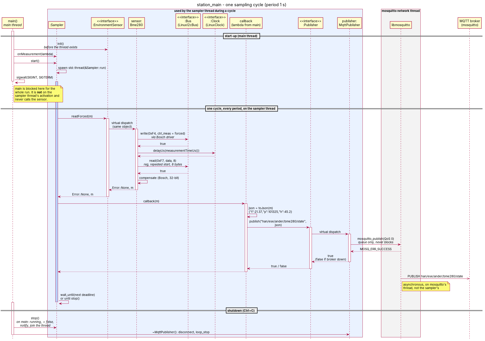

# Ander_PROG5 - BME280 sensor library (Prog 5)

C++ library for the Bosch BME280 (temperature, pressure, humidity). The Bosch BME280 SensorAPI
is wrapped in a class that talks to two abstractions, `Bus` and `Clock`, so the sensor code does
not depend on any particular board. The same core runs on Arduino (Week 3) and on a Raspberry Pi
through Linux `i2c-dev` (Week 4).

This is the **Week 5** state: a weather station program samples the sensor once per second on
its own thread and publishes every measurement as JSON over MQTT, while the sensor class still
knows nothing about MQTT, threads or JSON.

Earlier hand-ins are preserved in the tags `v0.3-arduino` (Week 3) and `v0.4-pi` (Week 4).

## Structure

```
include/bme280/     Bus.hpp, Clock.hpp (interfaces), Types.hpp, Bme280.hpp   <- core
include/station/    EnvironmentSensor.hpp (interface, implemented by Bme280)  <- week 5
                    Sampler, Publisher, ConsolePublisher, MqttPublisher, FakeSensor, Json
src/                Bme280.cpp (wraps the Bosch C driver)                    <- core
                    Bme280Lib.h, arduino_glue_*.{c,cpp}   <- Arduino IDE build glue (see below)
third_party/bme280/ Bosch BME280 SensorAPI v3.5.1, vendored unmodified (BSD-3-Clause)
platform/arduino/   ArduinoI2cBus (Wire), ArduinoClock (delay/delayMicroseconds)
platform/linux/     LinuxI2cBus (/dev/i2c-N, ioctl), LinuxClock (clock_nanosleep)
station/            Sampler.cpp (thread), MqttPublisher.cpp (libmosquitto)  <- week 5
examples/arduino/   ReadEverySecond, CustomConfig            (Arduino sketches)
examples/rpi/       smoke_test.cpp -> bme280_rpi_smoke       (Raspberry Pi)
examples/station/   station_main.cpp -> station_main         (week 5 composition root)
tests/              host tests: core with mocks, Arduino bus with a fake Wire, Linux bus with a
                    fake ioctl, Linux platform
cmake/              cross-compile toolchains for Raspberry Pi OS (aarch64, armhf)
docs/               week4_class_diagram.{puml,svg,png}, week5_sequence_diagram.{puml,svg,png}
CMakeLists.txt      core + Linux platform + examples + tests
library.properties  Arduino library metadata
```

The core (`include/bme280/*`, `src/Bme280.cpp`, `third_party/`) includes no Arduino, Wire or
Linux header, uses no `#ifdef` to tell platforms apart, and builds with any C++17 compiler.

## Week 5: sampling thread, callback, MQTT

```
station_main (composition root, the only place concrete classes meet)
   |
   |  EnvironmentSensor&            callback (lambda)              Publisher&
   v                                                                   |
Sampler --readForced()--> EnvironmentSensor <|-- Bme280 (Bus, Clock)   |
   |  own std::thread              <|-- FakeSensor                   v
   +--callback(m)--> lambda: publisher.publish(topic, toJson(m)) --> Publisher
                                                         <|-- MqttPublisher --> broker
                                                         <|-- ConsolePublisher
```

### Dependency Inversion

`Sampler` needs *something* it can call `readForced()` on. It depends on the interface
`station::EnvironmentSensor` (`init()`, `readForced(Measurement&)`), and `bme280::Bme280`
implements that interface: **Sampler -> EnvironmentSensor <- Bme280**. Neither the sampler nor
the sensor knows the other's concrete type. The same holds for the output: the callback only sees
`station::Publisher` (`bool publish(const std::string& topic, const std::string& payload)`),
implemented by `MqttPublisher` (libmosquitto) and `ConsolePublisher` (prints).

What the interface buys: `FakeSensor` (a temperature ramp 20.0, 20.1, ... 24.9 C, constant
101325 Pa and 45.2 %RH) replaces the BME280, and the **whole MQTT chain runs on a laptop with no
Pi and no sensor** - see the capture below and `test_mqtt_publisher`.

The only change to the Week 4 class: `Bme280` derives from `EnvironmentSensor`, `readForced()`
gets `override`, and `init(const Config& = Config{})` became `init()` (the override) plus
`init(const Config&)`, because a defaulted parameter cannot override a parameterless virtual.
Calls `init()` and `init(config)` compile and behave exactly as before. `EnvironmentSensor` uses
relative includes like the core headers, so the Arduino sketches still build.

The sensor class contains no sampling period, threads, JSON or MQTT: its only wait is the
measurement time inside `readForced()` (through `Clock`), never a `sleep_for(1 s)`. The period
lives in the `Sampler`, the JSON in `toJson()`, the topic in `main()`.

### Composition root

`examples/station/station_main.cpp` is the only file that names concrete classes:

```cpp
bme280::LinuxI2cBus bus(0x76);                 // /dev/i2c-1      (or: station::FakeSensor sensor;)
bme280::LinuxClock  sysClock;                  // not `clock`: C already owns that name
bme280::Bme280      sensor(bus, sysClock);
station::MqttPublisher publisher("localhost", 1883);   // (or: station::ConsolePublisher)
station::Sampler    sampler(sensor, std::chrono::seconds(1));
sampler.onMeasurement([&](const bme280::Measurement& m) {        // the lambda is the callback
    if (!publisher.publish(topic, station::toJson(m))) { /* "publish failed (broker down?)" */ }
});
sampler.start();
sigwait(&stopSignals, &signal);                // main sleeps until Ctrl+C / SIGTERM
sampler.stop();
```

* **No `#ifdef`**: `--fake` and `--console` choose the sensor and publisher at run time.
* **No globals, no singletons**: `SIGINT`/`SIGTERM` are blocked before any thread is created and
  `main` waits for them with `sigwait()`, so no signal handler has to set a global flag.
* `Sampler` receives `EnvironmentSensor&`, never `Bme280&`.

```
station_main                    BME280 on /dev/i2c-1 @ 0x76, MQTT to localhost:1883
station_main --fake             FakeSensor instead of the BME280 (laptop)
station_main --console          print "topic payload" instead of MQTT
station_main --fake --console   no hardware, no broker
```

### Topic scheme and payload

| | |
|---|---|
| Topic | `han/ese/ander/bme280/state` (`han/ese/<name>/<sensor>/state`) |
| Payload | `{"t":21.37,"p":101325,"h":45.2}` - `t` in degC (2 decimals), `p` in Pa (0 decimals), `h` in %RH (1 decimal) |
| QoS / retain | 0 / not retained |
| Rate | one message per second |

### Broker on the Pi

```bash
sudo apt install mosquitto mosquitto-clients libmosquitto-dev
sudo systemctl enable --now mosquitto        # start now and at every boot
systemctl status mosquitto                   # "active (running)"
mosquitto_sub -h localhost -t 'han/ese/#' -v # leave running in a second terminal
```

Mosquitto 2.x only listens on localhost by default. To subscribe from a laptop, add
`listener 1883` and `allow_anonymous true` to `/etc/mosquitto/conf.d/lab.conf` and
`sudo systemctl restart mosquitto`.

Build and run on the Pi (I2C enabled, BME280 at 0x76, see "Raspberry Pi - native build" below):

```bash
cmake -S . -B build && cmake --build build -j
./build/examples/station/station_main          # Ctrl+C to stop
```

### `mosquitto_sub` capture

Captured on the **development laptop (x86-64 Linux), not on a Pi**: `station_main --fake` (the
`FakeSensor` ramp) publishing to a local mosquitto 2.0.18, subscribed exactly as the assignment
says:

```
$ mosquitto_sub -h localhost -t 'han/ese/#' -v
han/ese/ander/bme280/state {"t":20.10,"p":101325,"h":45.2}
han/ese/ander/bme280/state {"t":20.20,"p":101325,"h":45.2}
han/ese/ander/bme280/state {"t":20.30,"p":101325,"h":45.2}
han/ese/ander/bme280/state {"t":20.40,"p":101325,"h":45.2}
han/ese/ander/bme280/state {"t":20.50,"p":101325,"h":45.2}
```

The first sample (t = 20.00) is not in the capture: it is taken at t = 0, while the asynchronous
connect to the broker is still in progress, so `publish()` returns `false` for it and the station
prints `publish failed (broker down?)` once. That is the same broker-down path as below.

With the broker stopped, the station keeps sampling and prints `publish failed (broker down?)`
once per second; when the broker comes back, libmosquitto reconnects (1..10 s back-off) and
publishing resumes - tested in `test_mqtt_publisher` (`brokerRestartWhileSampling`) and
`station_e2e`.

### Threads: what can go wrong?

`station_main` runs three threads: **main** (set-up, then blocked in `sigwait()`), the **sampler
thread** (owned by `Sampler`: `readForced()`, then the callback - so `toJson()` and
`publisher.publish()` also run there), and **mosquitto's network thread** (started by
`MqttPublisher`, sends the queued messages and runs its connect/disconnect callbacks).

**Shared state: `MqttPublisher::connected_`.** It is written by mosquitto's network thread (in
`onConnect`/`onDisconnect`, when the broker comes and goes) and read by the sampler thread in
every `publish()`. A plain `bool` would be a data race (undefined behaviour). It is a
`std::atomic<bool>`: a single flag with no invariant tied to other data, so an atomic is enough
and no mutex is needed. `mosquitto_publish()` itself may be called from the sampler thread
because libmosquitto protects its own outgoing queue when the network loop runs on its thread
(`mosquitto_loop_start`).

Other state, and why it is safe:

* **The sensor (and its `Bus`)** is not thread-safe and does not need to be: it has one owner at a
  time. `main` calls `init()` *before* `start()`; between `start()` and `stop()` only the sampler
  thread calls `readForced()`. `test_station` checks that two `readForced()` calls never overlap.
* **`Sampler::running_` and the callback** are shared between the owner (`start/stop/onMeasurement`)
  and the sampler thread: both are guarded by the sampler's mutex. `running_` is changed *under*
  the mutex in `stop()`; otherwise the flag could change between the thread checking it and
  starting to wait, the notify would be lost and `stop()` would wait a full period.
* **`topic`** is a `const std::string` that is never written after the thread starts, so reading
  it from the callback needs no protection.

**Bonus - `stop()` within one period, even with a slow sensor.** The thread sleeps in
`condition_variable::wait_until(next deadline)`; `stop()` notifies it, so `stop()` never waits out
the rest of a period. If a read is in progress, `stop()` waits for that read only and starts no
new one (`test_station`: 300 ms read, 1 s period -> `stop()` returns after the read, well within one
period). A read that *never* returns cannot be interrupted safely - the thread is never detached,
because it uses the sampler, the sensor and the callback, which would be destroyed under it.

The period is counted from the start (`next += period`), so a 30 ms read does not stretch a
100 ms period to 130 ms (`test_station: periodDoesNotDriftWithReadTime`).

### Sequence diagram



([PlantUML source](docs/week5_sequence_diagram.puml), [SVG](docs/week5_sequence_diagram.svg))
One cycle: `Sampler` -> `EnvironmentSensor` -> `Bme280` -> `Bus`/`Clock` -> back -> callback ->
`Publisher` -> `MqttPublisher` -> libmosquitto -> broker. The blue activation bar is the sampler
thread; `main` is blocked in `sigwait()` and is not on it. The `PUBLISH` to the broker happens
on mosquitto's network thread.

### Differences from the course starter (`Code/week5/mqtt_station`)

* Starter `main.cpp` uses `#ifdef STATION_HAS_HARDWARE` and a global `keepRunning` flag; the
  assignment forbids both, so the choice is made at run time and Ctrl+C goes through `sigwait()`.
* `Sampler`: `running_` set under the mutex (lost wake-up), callback copied under the mutex
  (`onMeasurement()` while running is not a data race), deadlines instead of sleeping a full period
  after each read (no drift). Same public API.
* `MqttPublisher`: `mosquitto_loop_start()` is called **before** `mosquitto_connect_async()`. With
  libmosquitto 2.0.18 a first connect that fails before the loop runs is never retried, so the
  starter order never connects if the broker is down when the station starts (reproduced; the
  `brokerDownAtStartThenComesUp` test fails with the starter order).
* `toJson()` moved from `main.cpp` to `include/station/Json.hpp` so it can be unit-tested; same
  format string. `FakeSensor` also sets humidity (45.2 %RH; the starter left it 0).
* `Bme280` implements `EnvironmentSensor` directly, so the starter's `Bme280Adapter` is not needed.

### Week 5 tests

* `test_station` (13 tests): `FakeSensor` ramp; exact JSON (assignment example, negative,
  rounding); callback on the sampler thread (not main, always the same thread) with the ramp in
  order; no callback after `stop()` returns; destructor stops and joins; double `start()`/`stop()`,
  `stop()` before `start()`, restart; failed reads skip the callback but sampling goes on; no
  overlapping `readForced()` (period shorter than the read); `stop()` does not wait out a 10 s
  period; slow sensor (bonus); no drift; replacing the callback while running; no callback set.
* `test_mqtt_publisher` (6 tests): broker down (constructor returns at once, `publish()` false,
  destructor quick); sampler keeps sampling with the broker down; then, with a **real mosquitto**
  the test starts on a free port: exact topic + payload, full chain `FakeSensor -> Sampler ->
  lambda -> toJson -> MqttPublisher -> broker -> subscriber` in order, broker down at start then
  up, broker killed and restarted while sampling. Without a broker binary these four are reported
  `SKIP`, not passed.
* `station_e2e` (`tests/station_e2e.sh`, runs `station_main` itself): `--fake --console` output,
  clean error without `/dev/i2c-1`, broker down, and a real broker on `:1883` checked with
  `mosquitto_sub -t 'han/ese/#' -v`. Exit 77 (= skipped) if no broker or the port is taken.
* `test_core` additionally checks that `Bme280` is an `EnvironmentSensor` and works through it.

### Week 5 verification status

Checked in software on an x86-64 Linux host (Ubuntu 24.04, GCC 13.3, Clang 18.1.3, CMake
3.28, mosquitto/libmosquitto 2.0.18), all builds with `-Wall -Wextra -Wpedantic -Werror`:

| Check | Result |
|---|---|
| Clean configure/build/test, GCC (`build-clean`) | 0 warnings; 7/7 suites pass (`core`, `arduino_platform_fake`, `linux_i2c_bus_fake`, `linux_platform`, `station`, `mqtt_publisher`, `station_e2e`), none skipped |
| Clang, same flags | 0 warnings; 7/7 pass |
| Core + station without the Linux layer (`-DBME280_BUILD_LINUX=OFF`) | 0 warnings; 4/4 pass |
| AddressSanitizer + UndefinedBehaviorSanitizer | 7/7 pass, no reports |
| **ThreadSanitizer** (whole suite, incl. real-broker tests and `station_main`) | 7/7 pass, 0 reports |
| Valgrind memcheck + `--track-fds` (`test_core`, `test_station`, `test_mqtt_publisher` with broker, `station_main --fake --console`) | 0 errors, 0 leaks, 0 leaked fds |
| cppcheck 2.13 on core, station, `station_main`, Linux platform | 0 findings |
| Real MQTT round trip on this host: `station_main --fake` -> mosquitto -> `mosquitto_sub -t 'han/ese/#' -v` | capture above |
| Broker down (at start, and killed + restarted while sampling) | `publish()` false, sampling continues, reconnects |
| Cross build aarch64 / armhf | 0 warnings; 5/5 pass under `qemu-aarch64` / `qemu-arm`. `MqttPublisher` and `station_main` **not** cross-built: no ARM libmosquitto in this environment (they build natively on the Pi) |
| Week 3 Arduino sketches (`nano_33_iot`, arm-none-eabi-gcc, same recipe as Week 4) | compile and link, 0 library/sketch warnings; flash 27292 B (`ReadEverySecond`, was 27220 B: +72 B for the vtable) |
| Week 4 tests and `bme280_rpi_smoke` | unchanged results |
| Tests catch the starter's bugs (checked by re-introducing each) | drift -> `periodDoesNotDriftWithReadTime` fails; no notify in `stop()` -> `stopDoesNotWaitOutThePeriod` fails; starter connect order -> `brokerDownAtStartThenComesUp` fails |

**Not verified (pending hardware):** no Raspberry Pi and no BME280 were available. `station_main`
has not run with the real sensor, the Pi's mosquitto service, or over a real I2C bus; the capture
above comes from the `FakeSensor` on a laptop. To complete it on the Pi:

```bash
./build/examples/station/station_main &            # real BME280 @ 0x76
mosquitto_sub -h localhost -t 'han/ese/#' -v       # expect plausible room values once per second
```

and paste that capture here.

## Week 4: Bus/Clock split


([PlantUML source](docs/week4_class_diagram.puml), [SVG](docs/week4_class_diagram.svg))

```
Bme280 --> Bus                 ArduinoI2cBus --|> Bus      LinuxI2cBus --|> Bus
Bme280 --> Clock               ArduinoClock  --|> Clock    LinuxClock  --|> Clock
```

All arrows point *into* the core: the platform classes depend on the abstractions, the core
never depends on a platform (Dependency Inversion). Nothing in `include/` or `src/Bme280.cpp`
names Arduino or Linux.

In Week 3, `Bus` had three methods: `read()`, `write()` and `delayUs()`. Week 4 moves the delay
into its own interface:

```cpp
class Bus {                                    class Clock {
public:                                        public:
    virtual ~Bus() = default;                      virtual ~Clock() = default;
    virtual bool read(uint8_t reg, uint8_t* data,  virtual void delayUs(uint32_t us) = 0;
                      size_t len) = 0;         };
    virtual bool write(uint8_t reg, const uint8_t* data, size_t len) = 0;
};

Bme280(Bus& bus, Clock& clock);
```

The `read()`/`write()` signatures are unchanged from Week 3. `Bme280` stores both references.
The Bosch driver's single `intf_ptr` now points at the `Bme280` object itself, so the C read/write
callbacks reach `bus_` and the delay callback reaches `clock_`. `readForced()` waits for the
measurement through `clock_`, and the soft reset in `init()` waits the 2 ms startup time
through it too. Because of that back pointer, `Bme280` is non-copyable **and** non-movable.

### Why split them (Interface Segregation Principle)

ISP: no client should be forced to depend on methods it does not use, and no implementer should
be forced to provide them.

* **Different responsibilities, different reasons to change.** Moving bytes over I2C and
  waiting are unrelated. On Linux they are even different kernel facilities (`ioctl` on a
  device node vs. `clock_nanosleep`). Keeping them in one class meant `LinuxI2cBus` would have
  had to implement sleeping, and a future `SpiBus` would have to implement it a third time.
* **Sharing.** A board has one clock but can have several buses and sensors. With the split,
  one `LinuxClock` is passed to every driver (see the `twoSensorsShareOneClock` test) instead
  of every bus carrying its own copy of the delay code.
* **Testing.** A test can swap only the clock (`FakeClock` records delays and returns
  immediately) or only the bus, so a test can check *that* a delay happens and *how long* it is
  without sleeping.
* **Smaller contracts are easier to substitute (LSP, below).** A bus implementation now only
  has to get bytes right; a clock only has to wait long enough.

## LSP check

`Bme280` only relies on the two contracts:

* `Bus::read()` fills exactly `len` bytes from register `reg` and returns `true`, or returns
  `false`. `Bus::write()` puts register + `len` bytes on the bus and returns `true`, or returns
  `false`. A read must be one combined transaction (register pointer, **repeated start**, data)
  because the BME280 burst-reads its data registers as one consistent snapshot.
* `Clock::delayUs()` blocks for **at least** `us` microseconds.

Any implementation that keeps these (`ArduinoI2cBus`/`LinuxI2cBus`, `ArduinoClock`/`LinuxClock`,
`MockBus`/`FakeClock` in the tests) can be passed in without the sensor class noticing. What
would break substitutability:

* A bus that returns `true` but transfers fewer bytes. The driver would compute believable but
  wrong values from stale calibration data.
* A clock that returns early, for example a plain `nanosleep()` interrupted by a signal. The
  measurement would be read before it is finished. `LinuxClock` sleeps until an absolute
  `CLOCK_MONOTONIC` deadline and restarts on `EINTR`; `test_linux_platform` checks this with
  `SIGALRM` firing every 2 ms.
* A bus that throws from `read()`/`write()`, or needs a call the sensor does not know about.
  `LinuxI2cBus` only throws from its *constructor*: a `LinuxI2cBus` that exists is ready.

Both bus implementations validate arguments identically and return `false` **without any bus
traffic** for: a read into a null buffer, a read of 0 or more than 32 bytes, a write with a null
buffer and `len` > 0, and a write of more than 31 data bytes (register byte + data > 32). This
rule is spelled out in `Bus.hpp`. So the core sees the same behaviour on both platforms. The
Bosch driver never transfers more than 26 bytes at once.

| Contract point | `ArduinoI2cBus` | `LinuxI2cBus` |
|---|---|---|
| null buffer / bad length rejected | yes (null check added in the Week 4 review) | yes |
| read = register pointer + repeated start + data | `endTransmission(false)`, then `requestFrom()` | one `I2C_RDWR` with 2 messages |
| success only if exactly `len` bytes arrived | `requestFrom()` must return `len` | ioctl must report 2 messages done |
| write = `[reg, data...]` in one transaction | one `beginTransmission`..`endTransmission()` | one message |
| tested by | `test_arduino_platform_fake` | `test_linux_i2c_bus_fake` |

## Platforms

### Arduino (`platform/arduino/`)

* `ArduinoI2cBus` - only `Bus`. Wire code is unchanged from Week 3: `read()` uses
  `endTransmission(false)` (repeated start, no STOP) followed by `requestFrom()`, and checks
  both results; `write()` sends register + data in one transmission.
* `ArduinoClock` - only `Clock`: `delay(us / 1000)` + `delayMicroseconds(us % 1000)`
  (`delayMicroseconds()` alone is only accurate up to ~16 ms on AVR).

```cpp
#include <Wire.h>
#include <Bme280Lib.h>

static bme280::ArduinoI2cBus bus(Wire, static_cast<uint8_t>(bme280::I2cAddress::Low));
static bme280::ArduinoClock  sensorClock;   // not "clock": would clash with ::clock()
static bme280::Bme280        sensor(bus, sensorClock);

void setup() { Wire.begin(); sensor.init(); }
```

### Linux / Raspberry Pi (`platform/linux/`)

* `LinuxI2cBus` - only `Bus`, an RAII owner of one `/dev/i2c-N` file descriptor:
  * constructor: `open(device, O_RDWR | O_CLOEXEC)`, then `ioctl(I2C_SLAVE, address)`. If either
    fails it throws `std::system_error` with the `errno` (e.g. `ENOENT`: I2C not enabled,
    `EACCES`: not in group `i2c`, `EBUSY`: a kernel driver owns the address). On failure after
    `open()`, the fd is closed before throwing, because the destructor does not run.
  * destructor: `close(fd)`.
  * non-copyable (two owners would close one fd) and non-movable (a `Bme280` keeps a `Bus&` to
    it).
  * `read()`: **one** `ioctl(I2C_RDWR)` with two messages, `[addr+W, reg]` and
    `[addr+R, len bytes]`. The kernel sends them as `START addr+W reg  Sr addr+R data... STOP`,
    the same repeated-start transaction Arduino produces with `endTransmission(false)`. A
    separate `write()` + `read()` on the fd would insert a STOP.
  * `write()`: one message `[addr+W, reg, data...]`.
  * Both return `false` on any kernel error (`EREMOTEIO` = NACK, timeouts, ...).
* `LinuxClock` - only `Clock`: `clock_nanosleep(CLOCK_MONOTONIC, TIMER_ABSTIME, deadline)`,
  restarted on `EINTR`. It is unaffected by wall-clock changes and never returns early.

Ownership in the smoke test: the bus and the clock are declared before the sensor, so they
outlive it (locals are destroyed in reverse order); the sensor only borrows them.

```cpp
#include <bme280/Bme280.hpp>
#include "LinuxClock.hpp"
#include "LinuxI2cBus.hpp"

{
    bme280::LinuxI2cBus bus(0x76);          // opens /dev/i2c-1, throws on failure
    bme280::LinuxClock  clock;
    bme280::Bme280      sensor(bus, clock);  // same core as on Arduino

    if (sensor.init() == bme280::Error::None) {
        bme280::Measurement m;
        sensor.readForced(m);                // m.temperatureC, m.pressurePa, m.humidityPct
    }
}                                            // ~Bme280, then ~LinuxI2cBus closes the fd
```

## Building

### CMake targets

| Target             | Contents                                   | Built when                     |
|--------------------|--------------------------------------------|--------------------------------|
| `bme280_bosch`     | vendored Bosch SensorAPI (C99)             | always                         |
| `bme280_core`      | `Bme280` + `Bus`/`Clock` (C++17)           | always                         |
| `bme280_linux`     | `LinuxI2cBus`, `LinuxClock`                | `BME280_BUILD_LINUX` (default: on when targeting Linux) |
| `bme280_rpi_smoke` | Raspberry Pi smoke test                    | `BME280_BUILD_EXAMPLES` + Linux |
| `bme280_station`   | `Sampler` (+ header-only `Publisher`, `ConsolePublisher`, `FakeSensor`, `toJson`) | `BME280_BUILD_STATION` (default on) |
| `bme280_station_mqtt` | `MqttPublisher` - the only target linking libmosquitto | libmosquitto found |
| `station_main`     | week-5 composition root                    | `BME280_BUILD_EXAMPLES` + Linux + libmosquitto |
| `test_*`           | host tests (CTest)                         | `BME280_BUILD_TESTS`           |

The platform is picked in CMake (which subdirectory is added), never inside the core.
`-DBME280_WARNINGS_AS_ERRORS=ON` adds `-Werror` to `-Wall -Wextra -Wpedantic`.

### Laptop / host (any Linux)

```bash
cmake -S . -B build -DBME280_WARNINGS_AS_ERRORS=ON
cmake --build build -j
ctest --test-dir build --output-on-failure
```

Core only (e.g. on macOS/Windows, or to prove the core builds without the Linux layer):

```bash
cmake -S . -B build-core -DBME280_BUILD_LINUX=OFF
cmake --build build-core && ctest --test-dir build-core
```

### Raspberry Pi - native build on the Pi

```bash
sudo raspi-config nonint do_i2c 0      # enable I2C (or: raspi-config -> Interface Options)
sudo apt install cmake g++ i2c-tools
sudo usermod -aG i2c "$USER"           # log out/in afterwards
i2cdetect -y 1                         # BME280 should show up as 76 or 77

cmake -S . -B build && cmake --build build -j
ctest --test-dir build                 # host tests, no sensor needed
./build/examples/rpi/bme280_rpi_smoke                  # /dev/i2c-1, 0x76, every 1 s, 10 times
./build/examples/rpi/bme280_rpi_smoke /dev/i2c-1 0x77 2000 0   # 0x77, every 2 s, until Ctrl+C
```

Wiring (Pi header): VIN -> pin 1 (3V3), GND -> pin 6, SDA -> pin 3 (GPIO2), SCL -> pin 5
(GPIO3). SDO to GND = `0x76`, SDO to 3V3 = `0x77`.

Exit codes: `0` all reads OK, `1` setup or `init()` failed (message on stderr, e.g.
`open /dev/i2c-1: No such file or directory`, `init failed ...: WrongChipId`), `2` a read failed.
If you get `EBUSY`, a kernel driver (`dtoverlay=i2c-sensor,bme280`) has claimed the sensor;
remove that overlay.

### Raspberry Pi - cross-compile from a laptop

```bash
sudo apt install g++-aarch64-linux-gnu qemu-user     # 64-bit Raspberry Pi OS
cmake -S . -B build-rpi -DCMAKE_TOOLCHAIN_FILE=cmake/aarch64-linux-gnu.cmake
cmake --build build-rpi -j
ctest --test-dir build-rpi        # runs the ARM binaries under qemu-aarch64
scp build-rpi/examples/rpi/bme280_rpi_smoke pi@raspberrypi.local:
```

For 32-bit Raspberry Pi OS use `cmake/arm-linux-gnueabihf.cmake` (`g++-arm-linux-gnueabihf`).

### Arduino

Target: SAMD21 boards (`architectures=samd`, e.g. Arduino Nano 33 IoT, MKR, Zero). The AVR core
does not ship `<cstdint>`/`<cstddef>`, which the core headers use.

1. Copy or symlink this repository into your Arduino `libraries/` folder as `Bme280Lib`.
2. Open *File -> Examples -> Bme280Lib -> arduino -> ReadEverySecond*.
3. Wiring: VIN -> 3V3, GND -> GND, SDA -> SDA, SCL -> SCL. SDO open or to GND = `0x76`,
   SDO to 3V3 = `0x77` (then change `I2cAddress::Low` to `I2cAddress::High` in the sketch).
4. Upload and open the Serial Monitor at 115200 baud.

```bash
arduino-cli compile -b arduino:samd:nano_33_iot --library . examples/arduino/ReadEverySecond
```

#### Arduino IDE build glue

The Arduino IDE only compiles files under a library's `src/` folder and only puts `src/` on the
include path. To keep the mandatory layout, `src/` has three small glue files:

* `Bme280Lib.h` - what a sketch includes; it includes the core header, `ArduinoI2cBus.hpp` and
  `ArduinoClock.hpp`.
* `arduino_glue_bosch.c` - compiles `third_party/bme280/bme280.c`.
* `arduino_glue_platform.cpp` - compiles `platform/arduino/ArduinoI2cBus.cpp` and
  `ArduinoClock.cpp`.

The glue `.c`/`.cpp` files are wrapped in `#if defined(ARDUINO)`, so they are empty on any
other platform; CMake never compiles them. `platform/linux/` is outside `src/`, so the Arduino
IDE never sees it. The core itself does not include any glue file.

## Tests

All tests are plain executables (a tiny harness in `tests/TestMain.hpp`, no external framework).

* `test_core` - the core with `MockBus` + `FakeClock`. The `MockBus` is backed by `FakeBme280`,
  a register-level model of the chip loaded with the calibration example from the Bosch datasheet
  (section 8.1), so the expected results are known: **25.08 degC** and **~100653 Pa**. It checks:
  init and soft reset, delays only through the `Clock` (2000 us reset, `measurementTimeUs()`
  before a forced read), config bits written to `ctrl_hum`/`ctrl_meas`/`config`, wrong chip ID,
  bus failure, no bus traffic before `init()`, and two sensors sharing one clock. It also checks
  at compile time that `Bus` has no `delayUs()`, `Clock` has no `read()`, both have virtual
  destructors, `Bme280` needs both and is neither copyable nor movable.
* `test_arduino_platform_fake` - the real `ArduinoI2cBus.cpp` and `ArduinoClock.cpp`
  compiled on the host against a recording fake `Wire.h`/`Arduino.h` (`tests/fake_arduino/`,
  on this test's include path only; the library and sketches never see them). It checks that
  a read is `beginTransmission`, `endTransmission(false)` (repeated start), `requestFrom(addr, len)`;
  that a short `requestFrom()` or a NACK fails without copying; that a write sends `[reg,
  data...]` in one transmission; null buffers and bad lengths are rejected with no Wire calls;
  and that `ArduinoClock` splits 9300 us into `delay(9)` + `delayMicroseconds(300)`. Without
  the Week 4 review fix, `read(reg, nullptr, 1)` crashes this test (segfault).
* `test_linux_i2c_bus_fake` - the executable defines its own `ioctl()` (and glibc's
  `__ioctl_time64`, which 32-bit time64 targets use), which the linker uses instead of libc's.
  The fake records every `I2C_RDWR` transaction. The test checks that a read is exactly
  `{addr, W, len 1, [reg]}` + `{addr, I2C_M_RD, len n}` in **one** ioctl (repeated start), and
  that a write is one `{addr, W, [reg, data...]}` message. It also checks length limits, that
  `EREMOTEIO` becomes `false`, `EBUSY` from `I2C_SLAVE` throws without leaking the fd, and that
  the unchanged core runs **end-to-end over `LinuxI2cBus` + `LinuxClock`**, giving the datasheet
  values.
* `test_linux_platform` - against the real kernel: missing device -> `ENOENT`, `/dev/null` (not
  an i2c-dev node) -> `ENOTTY`, no fd leak over 1000 failed constructions, `LinuxClock` waits
  at least the requested time (0 us .. 1.5 s), and still does with `SIGALRM` interrupting it
  every 2 ms.

## Verification status (Week 4)

Checked in software (Week 4):

| Check | Result |
|---|---|
| Clean configure/build/test, GCC 13.3: `cmake -S . -B build-clean -DBME280_WARNINGS_AS_ERRORS=ON` (`-Wall -Wextra -Wpedantic -Werror`) | 0 warnings, 4/4 test suites pass |
| Host build, Clang 18, same flags | 0 warnings, 4/4 pass |
| Core-only build (`-DBME280_BUILD_LINUX=OFF`) | 0 warnings, `core` + `arduino_platform_fake` pass (2/2) |
| Cross build aarch64 (Raspberry Pi OS 64-bit), `-Werror` | 0 warnings; 4/4 pass, **executed under `qemu-aarch64`** (CTest emulator) |
| Cross build armhf (Raspberry Pi OS 32-bit), `-Werror` | 0 warnings; 4/4 pass, **executed under `qemu-arm`** (CTest emulator) |
| AddressSanitizer + UndefinedBehaviorSanitizer | 4/4 pass, no reports |
| Valgrind memcheck + `--track-fds` on all 4 test executables | no errors, no leaked fds |
| cppcheck 2.13 (`--enable=warning,style,performance,portability`, `-DBME280_32BIT_ENABLE` as in the build) on core, Arduino and Linux platforms, RPi example | no findings |
| No Arduino/Wire/Linux include, `ARDUINO`/`__linux__` macro or `ioctl` in `include/` or `src/Bme280.cpp` | confirmed by grep; `nm -u` of `libbme280_core.a` lists only Bosch symbols and `__stack_chk_fail` |
| `bme280_rpi_smoke` (aarch64, under qemu) without hardware | clean error exit 1 for a missing `/dev/i2c-1`, for `/dev/null` (`ENOTTY`) and for an invalid address |
| Arduino: both Week 3 sketches + library for `nano_33_iot` with `arm-none-eabi-gcc` (not arduino-cli, see below) | compile and link, 0 warnings from library or sketches |

Arduino build note: `downloads.arduino.cc` was not reachable from the build environment, so
`arduino-cli core install` was impossible. The sketches were instead compiled and linked with
the same recipe arduino-cli uses (`platform.txt`/`boards.txt` flags, `-std=gnu++11 -Os
-mcpu=cortex-m0plus`, `-Wall -Wextra`) against ArduinoCore-samd 1.8.14 + ArduinoCore-API from
GitHub, with Ubuntu's `arm-none-eabi-gcc` 13.2.1. As a control, the unchanged `v0.3-arduino`
sketch built with the same script first. Flash (text) for `ReadEverySecond`: 27148 bytes (Week 3)
-> 27220 bytes (Week 4 incl. the review fix); `CustomConfig`: 27168 bytes. This proves the
sketches compile and link against the real SAMD core headers, but it is **not** an official
`arduino-cli`/Arduino IDE build: rerun
`arduino-cli compile -b arduino:samd:nano_33_iot --library . examples/arduino/ReadEverySecond`
on a machine with the SAMD core installed to confirm.

**Not verified (pending hardware):**

* No Raspberry Pi and no BME280 were available. The smoke test has **not** been run against a
  real `/dev/i2c-1` or a real sensor. The I2C transaction format was checked only against the
  fake kernel interface described above, not on a logic analyser or a real bus.
* The Arduino sketches have still only been compiled, not run (also no board available in
  Week 3).

To close this, run on a Pi with a BME280 connected:

```bash
i2cdetect -y 1                                     # expect 76 (or 77)
./build/examples/rpi/bme280_rpi_smoke /dev/i2c-1 0x76 1000 10
```

Expected: `BME280 ready ...` followed by ten lines with plausible room values (about 15..30 C,
95000..105000 Pa, 20..80 %RH), exit code 0. Paste that output here to complete the Week 4
hardware verification.
