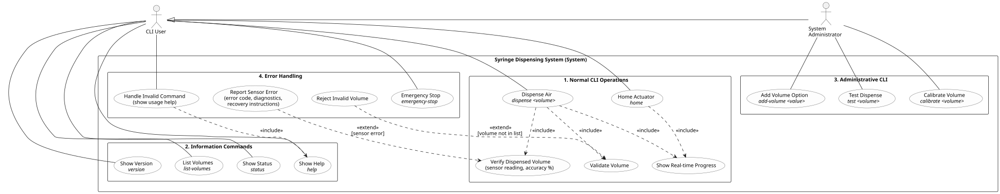

# Week 2 - Use case diagram: CLI syringe dispensing system

Assignment: a UML use case diagram with description for the "Stepper Motor Linear Actuator
Syringe System" in the course's `Prog5/Assignments/week2/syringe_system_requirements.md`: a
command-line controlled system that dispenses predefined volumes of air with a stepper-driven
syringe. This is a design deliverable; no code belongs to it.

| File | What |
| --- | --- |
| `syringe_use_cases.puml` | editable diagram source (PlantUML) |
| `syringe_use_cases.svg` / `.png` | rendered diagram (PlantUML 1.2025.4 + Graphviz) |
| `README.md` | this description |

Render again with `java -jar plantuml.jar -tsvg -tpng syringe_use_cases.puml`.

## Actors

| Actor | Who (from the requirements) | Uses |
| --- | --- | --- |
| **CLI User** | laboratory technician, student or researcher using the command line | normal operations, information commands, `emergency-stop`, gets error handling |
| **System Administrator** | uses admin commands for calibration and setup | the three administrative commands, **plus everything a CLI User can do** (generalization arrow: the administrator is a CLI User with extra rights) |
| **System** | "provides automated responses and status updates via CLI" | drawn as the **system boundary** "Syringe Dispensing System (System)" |

In UML the system under design is the subject (the rectangle), not an actor: an actor is
always outside the system. The requirements' third actor, "System", is therefore the boundary,
and its automated responses appear as the system's part of every use case (progress, status,
error messages).

## Relationships

* **Association** (solid line): an actor starts the use case.
* **Generalization** (hollow triangle, System Administrator -> CLI User): the administrator
  inherits all CLI User use cases. This is a modelling choice: the requirements say the admin
  "uses admin commands"; nothing says an administrator may not dispense or home.
* **`<<include>>`** (dashed arrow to the included use case): always part of the base use case.
  * Dispense Air includes Validate Volume ("system validates volume against predefined list"),
    Verify Dispensed Volume ("volume sensor measures actual air volume") and Show Real-time
    Progress ("real-time status updates via CLI").
  * Home Actuator includes Show Real-time Progress ("displays homing progress").
  * Handle Invalid Command includes Show Help ("invalid command syntax shows usage help").
* **`<<extend>>`** (dashed arrow to the base use case, with condition): only happens sometimes.
  * Reject Invalid Volume extends Validate Volume `[volume not in list]`.
  * Report Sensor Error extends Verify Dispensed Volume `[sensor error]`.

## Use case descriptions

### 1. Normal CLI Operations

**Dispense Air** - `dispense <volume>`
* Actor: CLI User. Includes: Validate Volume, Verify Dispensed Volume, Show Real-time Progress.
* Main flow:
  1. User enters `dispense <volume>`, e.g. `dispense 24.5`.
  2. System validates the volume against the list (Validate Volume).
  3. System prints `Dispensing 24.5ml of air...`.
  4. Actuator advances the predetermined distance for that volume, with progress
     (`Actuator moving... [...] 100%`).
  5. Volume sensor measures the dispensed air; system shows actual vs. target and accuracy
     (`Volume sensor reading: 24.3ml`, `Accuracy: 99.2%`).
  6. System prints the completion message with the actual volume (`Air dispensing complete.`)
     and stores the result for `status`.
* Alternative flows: invalid volume -> Reject Invalid Volume, nothing moves; sensor error ->
  Report Sensor Error; user enters `emergency-stop` -> Emergency Stop.
* NFR: finishes within 15 s; real-time text feedback.

**Home Actuator** - `home`
* Actor: CLI User. Includes: Show Real-time Progress.
* Main flow: user enters `home`; system prints `Homing actuator...`, retracts the actuator
  until the home switch triggers (`Home switch triggered.`), then confirms
  (`System homed successfully.`); the home position is now established (shown by `status`).
* Alternative flow: `emergency-stop` during homing -> Emergency Stop.

**Validate Volume** (included)
* Checks the requested volume against the predefined list: 12.25, 21.0, 24.5, 28.0, 36.75,
  73.5 ml (plus volumes added by an administrator). Not in the list -> Reject Invalid Volume.

**Verify Dispensed Volume** (included)
* Volume sensor measures the actual air volume; system shows actual vs. target and the
  accuracy percentage. The result is kept as "last operation" for `status`.
  Sensor error -> Report Sensor Error.

**Show Real-time Progress** (included)
* Text status updates on the CLI while the actuator moves (dispensing and homing).

### 2. Information Commands

**List Volumes** - `list-volumes`: prints `Available volumes (ml): 12.25, 21.0, 24.5, 28.0,
36.75, 73.5`.

**Show Status** - `status`: prints the system state (`Ready`), the last operation with target
and actual volume, whether the home position is established, and the sensor state. The
requirements list `status` under both "Normal CLI Operations" (status queries) and
"Information Commands"; it is modelled once, in the Information Commands package.

**Show Help** - `help`: prints all available commands and their usage (built-in help system).
Also included by Handle Invalid Command.

**Show Version** - `version`: prints the system version and the calibration date.

All information commands: response within 2 s.

### 3. Administrative CLI (System Administrator)

**Calibrate Volume** - `calibrate <volume>`: calibrates the setting for one specific volume.
The calibration date shown by `version` is expected to change as a result (see open questions).

**Add Volume Option** - `add-volume <value>`: adds a new volume to the list of valid volumes
(admin only). Afterwards it appears in `list-volumes` and is accepted by Validate Volume.

**Test Dispense** - `test <volume>`: performs a test dispensing run without actual air flow.

### 4. Error Handling

**Emergency Stop** - `emergency-stop`: immediately halts all operations (actuator motion
included). Available to every user, at any time.

**Handle Invalid Command**: an unknown command or wrong syntax shows the usage help
(includes Show Help), with a clear, actionable error message.

**Reject Invalid Volume** (extends Validate Volume): the volume is not in the list; the system
shows an error message and nothing is dispensed. `list-volumes` shows the valid options.

**Report Sensor Error** (extends Verify Dispensed Volume): the system shows a diagnostic
message with a clear error code and recovery instructions.

## Requirements traceability

| Requirement (`syringe_system_requirements.md`) | Use case(s) |
| --- | --- |
| 1. `dispense <volume>`, valid volume list, validation, error for invalid volume | Dispense Air, Validate Volume, Reject Invalid Volume |
| 2. Dispense air: predetermined distance, real-time status, completion message | Dispense Air, Show Real-time Progress |
| 3. `home`: retract to home switch, progress, confirmation | Home Actuator, Show Real-time Progress |
| 4. Volume verification: sensor, actual vs. target, accuracy %, `status` shows results | Verify Dispensed Volume, Show Status |
| 5. `list-volumes`, `status`, `help`, `version` | List Volumes, Show Status, Show Help, Show Version |
| 6. `calibrate <volume>`, `add-volume <value>` (admin only), `test <volume>` | Calibrate Volume, Add Volume Option, Test Dispense (System Administrator) |
| 7. Invalid syntax shows usage help | Handle Invalid Command (includes Show Help) |
| 7. Sensor errors, error codes, recovery instructions | Report Sensor Error |
| 7. `emergency-stop` halts all operations | Emergency Stop |
| Actors: CLI User, System Administrator, System | the two actors; System = boundary |
| Categories 1-4 | the four packages in the diagram |

| Non-functional requirement | Where it applies |
| --- | --- |
| Text-based command line interface only | every use case is a CLI command; no other interface is drawn |
| Commands execute within 2 s | all commands (Information, Administrative, Emergency Stop, Handle Invalid Command) |
| Air dispensing completes within 15 s | Dispense Air |
| Real-time text status updates | Show Real-time Progress (Dispense Air, Home Actuator) |
| Clear, actionable error messages | Handle Invalid Command, Reject Invalid Volume, Report Sensor Error |
| Built-in help with usage examples | Show Help |

## MoSCoW proposal

The assignment allows prioritising with MoSCoW after consulting the product owner. This is a
**proposal to discuss**, not a decision from the product owner:

| Priority | Use cases |
| --- | --- |
| Must | Dispense Air, Validate Volume, Reject Invalid Volume, Home Actuator, Emergency Stop, Handle Invalid Command, List Volumes, Show Status |
| Should | Verify Dispensed Volume, Report Sensor Error, Show Real-time Progress, Show Help, Calibrate Volume |
| Could | Show Version, Test Dispense, Add Volume Option |
| Won't (this version) | none |

## Open questions for the product owner

The requirements do not answer these; the diagram does not assume an answer:

* Must the system be homed before `dispense` is accepted?
* Does `calibrate <volume>` accept only volumes already in the list, and does it update the
  calibration date shown by `version`?
* Is `add-volume` the only admin-only command, or are `calibrate` and `test` restricted too?
  (The diagram gives all three to the System Administrator, because the requirements list them
  as administrative commands.) How is the administrator identified on a CLI?
* What happens after `emergency-stop`: must the user home the system again?
* Which sensors besides the volume sensor can report errors (e.g. the home switch)?
